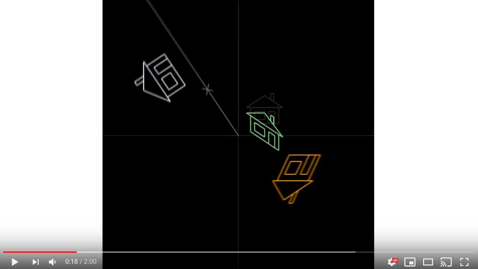

# Visualizing Matrix Decomposition

This `.NET Core` application generates animations. It applies LU and QR decompositions to linear transformations, and shows the effects of the factors independently. See example result:

And this is an example for the QR decomposition: https://www.youtube.com/watch?v=CWEhxN0hemE

# Install `.NET Core`

On Ubuntu 18.04 (as root):

    wget -q https://packages.microsoft.com/config/ubuntu/18.04/packages-microsoft-prod.deb
    dpkg -i packages-microsoft-prod.deb

    add-apt-repository universe
    apt-get install apt-transport-https
    apt-get update
    apt-get install dotnet-sdk-2.2

On Windows:
- https://dotnet.microsoft.com/download

# Run the application

    dotnet run -c Release

# To convert the images to videos, use FFMPEG:

    "E:\ffmpeg\ffmpeg.exe" -start_number 0 -loop 1 -t 120 -i "E:\path\to\source\frame_%4d.png" -c:v libx264 -b 2100K -vf "fps=30,format=yuv420p" E:\path\to\dest\LU_composite_RT.mp4
